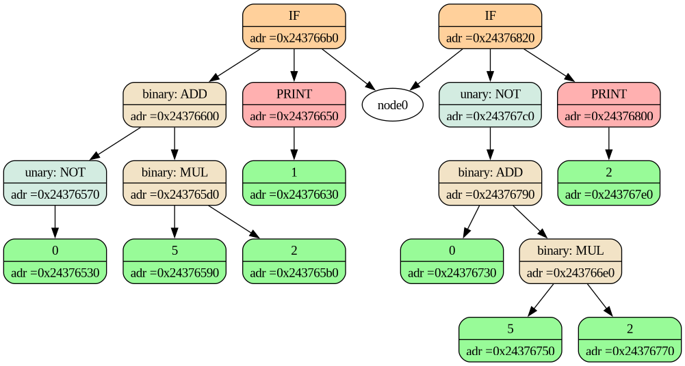

# Para C Language

Язык в стиле C. Использует Flex и Bison для синтаксического и лексического анализа, а также для разбора.

`Flex` — инструмент для создания лексических анализаторов (lexer) на основе регулярных выражений. 

`Bison` — генератор синтаксических анализаторов (parser) на основе контекстно-свободных грамматик.


## FRONTEND

### Лексический анализ
Первая фаза фронтенда — это ```лексический анализ``` и ```препроцессинг```. Ключевое понятие в этом процессе — это лексема или
токен. Токен представляет собой атомарную единицу анализа,
это что-то вроде отдельного слова или отдельного числа, или
отдельной запятой, и так далее. Обычно его хранят как объе-
динение его типа (ключевое слово, скобка, оператор, значение)
с его значением (int, правая скобка, оператор больше, -1.5).

`Главная задача лексического анализа` — это нормализовать
текст программы, в котором могут быть лишние переносы
строк, пробелы, странные отступы и так далее, и получить из
него массив токенов, над которым далее будет удобно работать
синтаксическому анализатору. Если в языке есть препроцессор,
то этот процесс становится двухфазным: сначала мы получаем
представление программы в так называемых препроцессинговых токенах, чтобы над ним было удобно работать макроподстановке, а потом уже получаем его же в обычных токенах.

Лексический анализ обычно сводится к разбору регулярных
выражений. Анализатор может быть написан ad hoc, но может
также быть автоматически сгенерированным такими программами, как `flex` из более высокоуровневого описания.

После лексического анализа и препроцессирования происходит синтаксический и семантический анализ.

### Синтаксичееский анализ 

Целью `синтаксического анализа` является (иногда неявное) построение синтаксического дерева (Abstract syntax tree, `AST`). Этот
процесс называют `синтаксическим разбором` или `парсингом`.
Синтаксическое дерево является представлением программы,
связывающим операции с зависимостями по данным. При этом
подвыражения являются вершинами этого дерева, дочерними
относительно выражений, которые из них состоят.


приветсти пример 

- Лексический анализатор
- Синтансический анализатор ( или парсер )
- Семантический анализатор  ( или проверка типов )
- Генерация промежуточного кода ( AST )

### Лексический анализ

[Лексический анализатор](https://habr.com/ru/articles/713434/)  — часть компилятора, которая читает текст программы из входного потока и преобразовывает его в набор лексем или токенов (неделимые примитивы языка, такие как ключевые слова, идентификаторы, строковые и числовые константы, операторы и др), которые в простейшем случае представляют собой структуру содержащую информацию о типе прочитанного токена и его значение. Так же лексический анализатор часто убирает из выходного потока «шум» (конструкции языка, которые не влияют на дальнейший разбор программы, такие как комментарии и пробельные символы (в языках, где отступы не являются значимыми для разбора программы))


### Синтаксический анализ

Синтаксический анализатор (парсер) — часть компилятора, основной целью которой является анализ потока токенов на принадлежность грамматике конкретного языка.

Часто результатом работы парсера является AST, которое содержит всю необходимую информацию для дальнейших стадий компилятора.

### Примеры 

Синтаксис ParaCL очень похож на синтаксис C. Примеры можно найти в каталоге [`common`](unit_tests/data/common/)

## Зависимости
В этом проекте для управления зависимостями используется менеджер пакетов Conan. Перед установкой Conan вам потребуется следующее

- CMake (минимальная версия 3.14)
- Компилятор C++20

Эти зависимости пока не обрабатываются Conan и должны быть установлены через системный менеджер пакетов:

- становлен Graphviz (команда `dot`)
- библиотека `questionary`
- `Flex`
- `Bison`


## Запуск проекта
```bash
git  clone https://github.com/MaxGud10/ParaCL
cd ParaCL
mkdir build
```

### `Pежим Release`
1. Создадим виртуальную среду и установим Conan:

```bash
python3 -m venv .venv && source .venv/bin/activate && pip3 install conan
```

2. Установим зависимости проекта с помощью Conan:
```bash
conan install . --output-folder=third_party --build=missing
```

3. Создаем проект:
```bash
cmake -B build -DCMAKE_BUILD_TYPE=Release -DCMAKE_TOOLCHAIN_FILE=./third_party/conan_toolchain.cmake
cmake --build build
```

### `Режим Debug`

1. Создадим виртуальную среду и установим Conan:

```bash
python3 -m venv .venv && source .venv/bin/activate && pip3 install conan
```
2. Установим зависимости проекта с помощью Conan:
```bash
conan install . --output-folder=third_party --build=missing -s build=Debug
```
3. Создаем проект
```bash
cmake -B build -DCMAKE_BUILD_TYPE=Debug -DCMAKE_TOOLCHAIN_FILE=./third_party/conan_toolchain.cmake
cmake --build build
```

## Тесты
Проект содержит unit-тесты (GoogleTest)

1. Создайте тесты:
```bash
cmake --build build
```
2. Запустите тестовый двоичный файл:
```bash
cd build
ctest --output-on-failure
```

## GraphViz



- Чтобы сгенерировать `dump` AST-дерева необходимо, чтобы в вашей `root` директории проекта находилась папка `dumps`
- Она генерируется `cmake'ом`, но лучше перепроверить, что она у вас есть в следующем виде:
```
├── dumps
│   ├── dot
│   └── png
```

⚠️ Если хотите сгененировать dump, то вызывайте его из корня проекта. В будущем мы это пофиксим, но пока что будет работать только так.

###### Инструкция по дампу
1. `./paracl file.dat --dump`. Это флаг для дампа.
    - он генерирует `.dot` в директории `dumps/dot`
2. `python3 dot2png.py` - это [скрипт](./dot2png.py) для генерации `.png` картинки из `.dot` файла.


